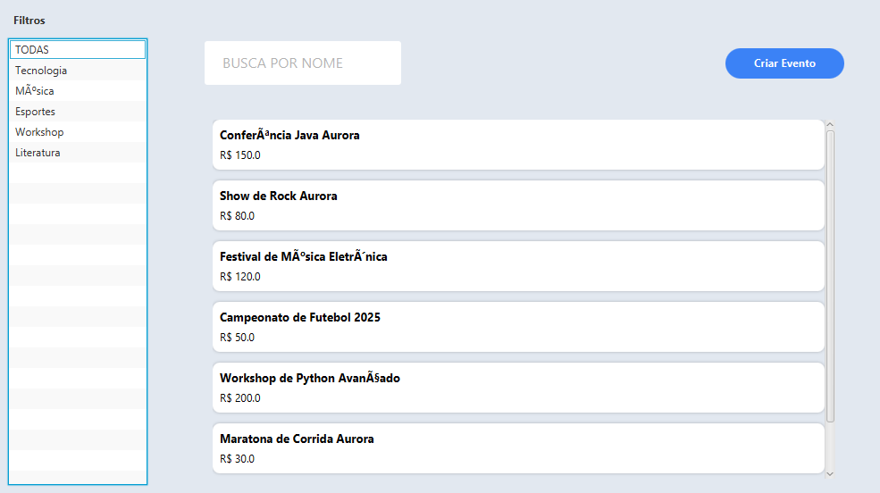
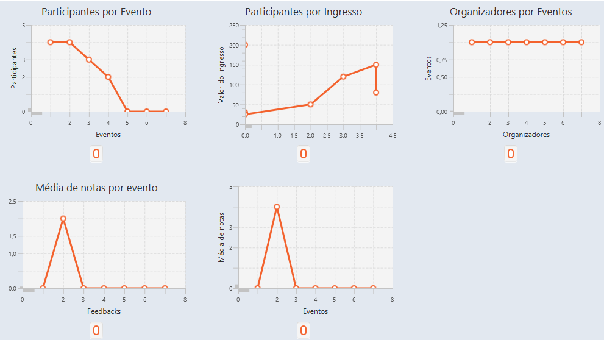

# Avaliação de Layse

# Projeto de Layse - Unidade 2 - Módulo de Relatórios e Estatísticas (Grupo 7)

>Este módulo foi desenvolvido para centralizar e apresentar estatísticas relevantes sobre os eventos cadastrados no sistema. Ele integra dados provenientes da API, processa informações de participação, organização e avaliações, e exibe tudo de forma visual por meio de gráficos dinâmicos e listas em JavaFX

## Tecnologias Utilizadas
- **Java**
- **JavaFX**
- **Spring Boot**
- **Spring JPA**
- **Maven**
- **Lombok**
- **H2 Database**

---

## Responsabilidades de Cada Membro

- **Pedro Souza**  
  > Estatísticas e parte do backend

- **Pedro Poderoso**  
  > CRUD de eventos no backend

- **Davi Gonçalves**  
  > Página inicial, filtros e parte do backend

- **João Sales**  
  > Geração de relatórios, métodos base para integração e parte do backend

### Página Inicial


### Página de Estatísticas


## Como Rodar o Projeto
```bash
cd src/main/java/com/auroraapp
mvn spring-boot:run
